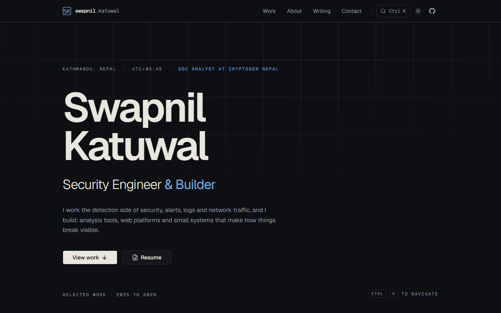
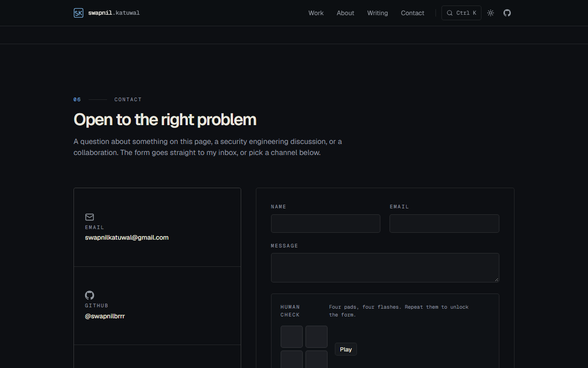

<div align="center">

# Swapnil Katuwal — Portfolio

**Security Engineer & Builder**

SOC Analyst at Cryptogen Nepal · Kathmandu, Nepal

[](https://nextjs.org)
[](https://react.dev)
[](https://www.typescriptlang.org)
[](https://tailwindcss.com)
[](../../actions/workflows/ci.yml)
[](#license)

[Live site](https://swapnilkatuwal.vercel.app) · [Work](https://swapnilkatuwal.vercel.app/work) · [About](https://swapnilkatuwal.vercel.app/about) · [Writing](https://swapnilkatuwal.vercel.app/writing)

</div>



---

A typography-led, dark-editorial portfolio for security engineering work.
Fully static (SSG), no third-party requests on initial page load, no
analytics, no trackers. The contact form calls EmailJS only when you press
send.

## Stack

| Layer      | Choice                                              | Why                                    |
| ---------- | --------------------------------------------------- | -------------------------------------- |
| Framework  | **Next.js 16** (App Router, React 19)               | Static prerender of every public route |
| Language   | **TypeScript** strict                               | Typed content model                    |
| Styling    | **Tailwind CSS 4** (`@theme` tokens, OKLCH)         | CSS-first design system                |
| Components | **shadcn/ui on Base UI**                            | Command palette, dialogs, inputs       |
| Motion     | **Motion 12** (`motion/react`)                      | Staggered reveals, reduced-motion safe |
| Fonts      | **Geist Sans / Geist Mono** via `next/font`         | Self-hosted, no font CDN needed        |
| Content    | Typed TS data + **MDX** posts (`next-mdx-remote`)   | Content lives next to the type system  |
| Email      | **EmailJS** (client-side, public IDs only)          | Contact form with game captcha         |
| QA         | Playwright scripts (local) + **GitHub Actions** CI  | Lint, typecheck, content checks, build |

## What's inside

- **Home** — hero, "Now" band, selected work, technical focus, experience, about, writing teaser, contact
- **Work** — editorial case studies per project (`/work/[slug]`) with source links
- **Writing** — MDX notes; drafts are dev-only and never appear in production HTML or the sitemap
- **About** — narrative, experience & education track record, certifications
- **Contact** — email form gated by a four-pad memory-pattern game (human check) plus a honeypot, sending through EmailJS
- **Command palette** — `Ctrl K` navigation
- **Theme toggle** — dark by default, persisted, hydration-safe
- **SEO** — JSON-LD (`Person` with `jobTitle: SOC Analyst`, `worksFor: Cryptogen Nepal`), OG image generated at build, sitemap, robots, canonicals



## Quick start

```bash
git clone https://github.com/swapnilbrrr/portfolio-.git
cd portfolio-
npm install
npm run dev        # http://localhost:3000
```

## Commands

| Command             | What it does                                  |
| ------------------- | --------------------------------------------- |
| `npm run dev`       | Dev server (draft posts preview here)         |
| `npm run build`     | Production build, all routes static           |
| `npm run start`     | Serve the production build                    |
| `npm run lint`      | ESLint (next/core-web-vitals)                 |
| `npm run typecheck` | `tsc --noEmit`                                |
| `npm test`          | Content checks: role wording, links, no em dashes, draft gating |

## Project structure

```
app/                  # routes (all static)
  work/[slug]/        # project case studies
  writing/[slug]/     # MDX posts (draft-gated)
components/
  sections/           # page sections (hero, work, contact form...)
  ui/                 # shadcn/Base UI primitives
content/writing/      # MDX posts
lib/
  site-config.ts      # single source of truth for URLs and identity
  data/               # projects, experience, skills (typed)
scripts/
  content-check.mjs   # CI content assertions
.github/workflows/    # CI: lint + typecheck + content checks + build
```

## Content model

All visible copy is data-driven: edit `lib/data/projects.ts`,
`lib/data/experience.ts` or add an MDX file under `content/writing/`.
Frontmatter `draft: true` keeps a post out of production builds, the sitemap
and every listing.

## Domain configuration

The deployed URL is a single switch:

```bash
NEXT_PUBLIC_SITE_URL=https://swapnilkatuwal.com.np
```

Defaults to `https://swapnilkatuwal.vercel.app`. Metadata, canonicals,
sitemap, JSON-LD and the OG image all derive from it, so moving to a custom
domain is a one-variable change.

## Deployment

Static output — deploys anywhere (`npm run build && npm run start`).
The live site runs on Vercel.

## CI

Every push and PR runs `.github/workflows/ci.yml` on Node 22:
install → lint → typecheck → content checks → production build.

## License

Private. All rights reserved.

<div align="center">

Built by [Swapnil Katuwal](https://github.com/swapnilbrrr) ·
[LinkedIn](https://www.linkedin.com/in/swapnil-katuwal-bb7529309)

</div>
